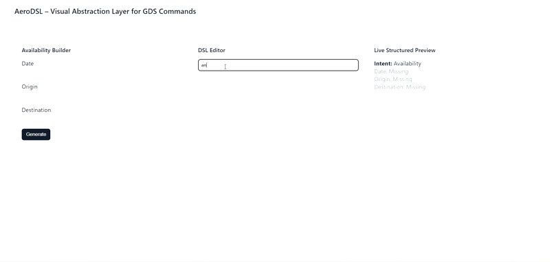
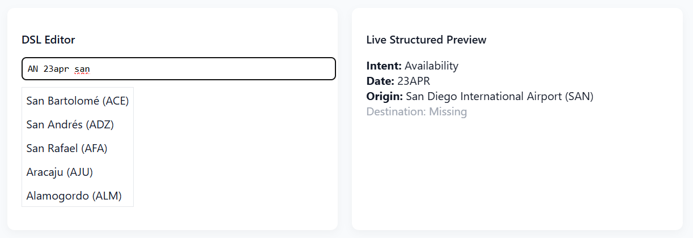
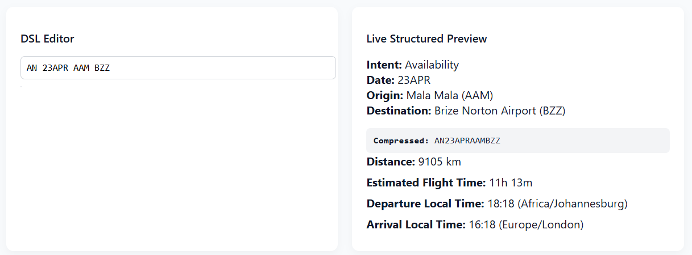

# 🛫 AeroDSL Spatial Engine

> A spatial abstraction layer for legacy aviation DSL systems.



---

## 🧭 Background — What is GDS?

Global Distribution Systems (GDS) such as **Amadeus**, **Sabre**, and **Travelport** power airline booking infrastructure worldwide. They rely on compact symbolic command syntax.

**Example:**

```
AN12DECKULSIN
```

| Token | Meaning |
|-------|---------|
| `AN` | Availability request |
| `12DEC` | Travel date |
| `KUL` | Kuala Lumpur |
| `SIN` | Singapore |

These systems were designed for terminal efficiency and trained operators. However, they:

- Provide no spatial visualization
- Require memorization of airport codes
- Offer minimal error feedback
- Lack temporal awareness

They are efficient — but not intuitive.

---

## 🎯 Project Objective

AeroDSL explores how symbolic aviation DSL commands can be augmented with:

- Geospatial intelligence
- Temporal modeling
- Live validation
- Interactive visualization

It does **not** replace GDS. It adds a **spatial-temporal abstraction layer** on top of it.

---

## ✈️ Core Capabilities

### 1️⃣ DSL Parsing & Validation Engine

- Intent detection (`AN`)
- Date format validation (`DDMMM`)
- Real-time IATA verification
- Structured live preview
- Syntax error highlighting


### 2️⃣ Airport Intelligence Layer

- IATA → Airport resolution
- Metadata enrichment (city, country)
- Autocomplete search
- Dataset preprocessing pipeline



### 3️⃣ Spatial Visualization Engine

- Interactive Leaflet map
- Route rendering between airports
- Continuous flight animation
- Distance computation (Haversine formula)
- Estimated flight time calculation
- Timezone-aware reasoning



---

## 🧮 Geospatial Computation

Distance is computed using spherical approximation:

- **Earth radius:** 6371 km
- **Formula:** Haversine
- **Cruise speed modeling:** ~800 km/h

This enables:

- Route distance estimation
- Flight time approximation
- Cross-timezone interpretation

---

## 🏗 System Architecture

**Backend**
- FastAPI
- DSL parser module
- Airport resolver engine
- Date normalization utility
- Preprocessed global airport dataset

**Frontend**
- Vanilla JavaScript
- Leaflet.js
- Real-time validation logic
- Route animation system

**Data Layer**
- Global airport dataset
- Latitude / Longitude metadata
- Timezone information

---

## 🧠 Design Philosophy

| Legacy Systems | Modern Requirements |
|----------------|---------------------|
| Compact symbolic syntax | Discoverability |
| Terminal efficiency | Visual reasoning |
| Operator familiarity | Spatial context |
| — | Error tolerance |

AeroDSL demonstrates how symbolic command systems can be **extended without modifying their underlying syntax**.

---

## 🚀 Future Extensions

- Multi-segment routing
- True great-circle interpolation
- Aircraft performance modeling
- Weather overlays
- Airline network visualization

---

## 📂 Repository Structure

```
core/
    parser.py
    generator.py
    resolver.py
    date_utils.py

data/
    airports.json

templates/
    index.html

assets/
    demo.gif
    error.png
    list.png
    result.png
```

---

## 📌 Project Scope

This project explores:

> **Symbolic DSL × Spatial Computing × Temporal Modeling**

It serves as a focused architectural experiment in modernizing legacy transportation command systems.
